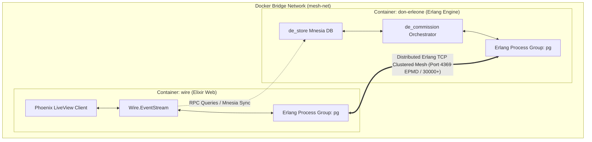
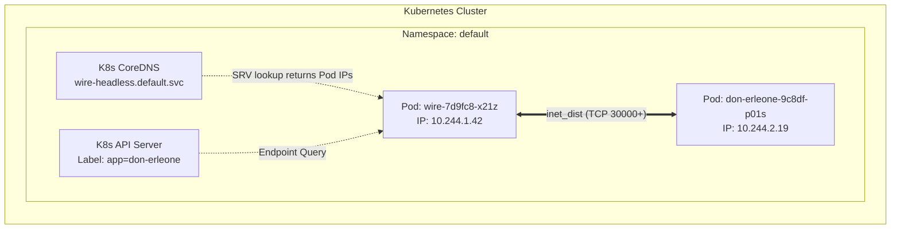

# Distributed BEAM VM Architecture & Integration

This document outlines the high-performance, low-latency distributed architecture of the agentic mesh, specifically detailing how the **Erlang Orchestrator (`don-erleone`)** and the **Elixir LiveView Web Interface (`wire`)** communicate natively on a shared Erlang Virtual Machine (BEAM) runtime cluster.

---

## 🗺️ System Topology

Rather than relying on REST, WebSockets, or gRPC for inter-container communication, the mesh uses native **BEAM Location Transparency**. By connecting the runtimes at the VM socket layer, both containers form a single clustered computing grid.



---

## 🔌 1. VM Clustering & Node Discovery

Clustering is bootstrapped at the infrastructure layer using **`libcluster`** on the Elixir side and native Erlang distribution flags on the backend.

### Connection Protocol:
1. Both nodes are booted with a shared `RELEASE_COOKIE` (`agentic_brain_secret`) and unique node names:
   * **Elixir Web Node**: `wire@wire`
   * **Erlang Backend Node**: `don_erleone@don-erleone`
2. Erlang's **EPMD (Erlang Port Mapper Daemon)** handles node discovery and socket mappings over port `4369` within the Docker Bridge network.
3. The nodes automatically establish a permanent, fully meshed Erlang distribution TCP socket. Once connected, they share an interconnected runtime space.

### ⚓ Kubernetes-Native Node Discovery (Production Cluster)

When deployed in a Kubernetes cluster, the static hostname resolution used in Docker Compose is replaced by dynamic, cloud-native discovery protocols via **`libcluster`** on the Elixir side and native environment configurations in Erlang.



#### The Two Production Discovery Strategies:
1. **Kubernetes DNS Strategy (`Cluster.Strategy.Kubernetes.DNS`)**:
   * A **Kubernetes Headless Service** (a Service with `clusterIP: None`) is declared for the stateful/deployment pods (e.g., `wire-headless`).
   * When `libcluster` boots, it queries the cluster's **CoreDNS** server for the headless service's A or SRV records (e.g., `wire-headless.default.svc.cluster.local`).
   * CoreDNS returns the raw, active Pod IPs (`10.244.1.42`, etc.) directly. The BEAM nodes then bind dynamically to their Pod IPs (e.g. `wire@10.244.1.42`) and establish native clustering.
2. **Kubernetes API Strategy (`Cluster.Strategy.Kubernetes`)**:
   * Pods are assigned a **ServiceAccount** with a `Role` permitting `list` and `watch` permissions on `endpoints` and `pods` resources.
   * `libcluster` queries the Kubernetes API server directly using a specific Label Selector (e.g., `app=don-erleone`).
   * It retrieves the Pod IPs of all running backend replicas and completes the TCP distribution handshake.

#### Network Overlay & Security Considerations:
* **Overlay Networks (Calico/Cilium/Flannel)**: The BEAM virtual machine requires direct Pod-to-Pod IP routing. The Kubernetes CNI must permit unencumbered TCP traffic on the EPMD discovery port (`4369`) and the release distribution port range (e.g., `30000-30009`).
* **SRE Health Probes (Liveness & Readiness)**: Kubernetes liveness and readiness probes query the `/api/health` HTTP endpoint on the `wire` pods. Because this endpoint dynamically queries `length(Node.list())`, Kubernetes can automatically drop a Pod from the ingress route if it loses cluster connectivity, preventing bad requests from reaching users.

---

## 🌀 2. Supervised Process Groups (`:pg` / PubSub Telemetry)

Real-time telemetry (operational events, agent reasoning outputs, Mnesia transactions) is streamed across the cluster using the Erlang core **Process Group (`:pg`)** registry. 

```
                                [ Event Broadcast Pipeline ]

 don-erleone (Erlang)                                                   wire (Elixir)
+--------------------+                                              +--------------------+
|  Mnesia Write/Sync |                                              |  Wire.ProcessGroup |
+---------+----------+                                              +---------+----------+
          |                                                                   |
          | (writes mission ledger)                                           | (boots & supervises :pg)
          v                                                                   v
+---------+----------+                                              +---------+----------+
|  de_store:modify   |                                              | Wire.EventStream   |
+---------+----------+                                              +---------+----------+
          |                                                                   |
          | pg:get_members(swarm_dashboard_events)                            | pg:join(swarm_dashboard_events)
          v                                                                   v
   [ PID Registry ] ==============================================> [ PID Registry ]
          |                                                                   |
          | Send Message: Pid ! {mission_event, Action, ID}                   | (adds subscriber PIDs)
          +------------------------------------------------------------------>|
                                                                              v
                                                                    +---------+----------+
                                                                    | SwarmDashboardLive |
                                                                    +---------+----------+
                                                                              |
                                                                              | (pushes instant DOM patch)
                                                                              v
                                                                        [ Web Browser UI ]
```

### The Supervised Process Lifecycle:
* **The Registry Wrapper**: We encapsulate the registry inside `Wire.ProcessGroup` as a first-class Elixir citizen under the root supervision tree:
  ```elixir
  children = [
    Wire.ProcessGroup, # Encapsulates `:pg.start_link()`
    Wire.Cluster,
    Wire.Telemetry,
    WireWeb.Endpoint
  ]
  ```
* **Location Transparency in Broadcasts**: Because `:pg` is clustered globally, `don-erleone` can resolve and push messages directly to web processes running on `wire` without knowing anything about WebSockets or HTTP:
  ```erlang
  broadcast_event(Event, MissionId) ->
      case pg:get_members(swarm_dashboard_events) of
          Pids when is_list(Pids) ->
              [Pid ! {mission_event, Event, MissionId} || Pid <- Pids],
              ok;
          _ -> ok
      end.
  ```

---

## 🗄️ 3. Mnesia Distributed Ledger Synchronization

**Mnesia** is the native distributed transactional database management system built into Erlang/OTP. 

Because `don-erleone` and `wire` share the clustered runtime, `wire` can execute direct read transactions against `don-erleone`'s Mnesia table space as if the database were running locally inside the web container.

### RPC Ledger Synchronization:
* The Phoenix web interface displays the transactional ledger by calling the presenter layer:
  ```elixir
  Wire.Swarm.get_dashboard_data()
  ```
* This context boundary executes a highly optimized, low-latency **Remote Procedure Call (RPC)** against the Erlang database query API:
  ```elixir
  :rpc.call(:"don_erleone@don-erleone", :de_dashboard_api, :get_recent_missions, [limit])
  ```
* If the backend container is offline, the web node detects the communication failure (`{:badrpc, _}`) and gracefully falls back to mock offline telemetry, keeping the UI online.

---

## 🏎️ 4. Location Transparency & Scheduling Vitals

Because the two runtimes are clustered, they function as a unified virtual operating system. This yields massive benefits for systems monitoring and SRE metrics:

### Querying VM Vitals over the Network:
We can directly extract scheduling and hardware metrics from the remote Erlang container using direct VM-level system queries:
* **Process Count**: `:rpc.call(Node, :erlang, :system_info, [:process_count])`
* **CPU Scheduler Run Queues**: `:rpc.call(Node, :erlang, :statistics, [:run_queue])`
* **Hardware Memory breakdown**: `:rpc.call(Node, :erlang, :memory, [])`

Because the BEAM scheduler thread is extremely lightweight (preemptive green threads with independent garbage collection heaps), these RPC calls take **less than 1 millisecond** to complete, bypassing standard network/serialization overheads completely.

---

## 🛡️ Systems Engineering Guarantees

1. **Failure Isolation (OTP Supervision)**: If `don-erleone` crashes or restarts, the `wire` application's supervisor network remains fully isolated and alive, displaying clear standalone recovery telemetry to the user.
2. **Immutable Container Layering (Nix/OCI)**: Both containers are compiled as distroless Nix layers, minimizing attack surface and runtime vulnerabilities by stripping all unnecessary UNIX binaries (such as bash/sh) and exposing only the optimized BEAM runner.
3. **Unified Protocol Security**: The entire inter-node transport is secured over a single release cookie protocol, presenting a secure, private, and highly performant agentic grid.
