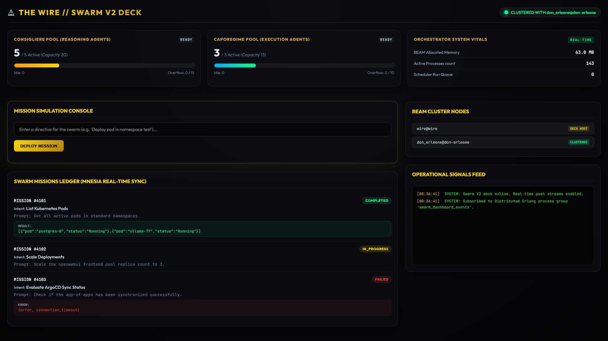

# Coloss-AI - Distributed Deterministic Agent Platform


<video src="apps/don-erleone/wire-dashboard.mp4"/>

> A hermetic, GitOps-driven local Kubernetes testbed orchestrating BEAM actor nodes, Haskell MCP microservices, and hardware-accelerated LLM inference.

[](flake.nix)
[](helm/)
[](#subsystems)

---

## 1. System Architecture

```text
+-----------------------------------------------------------------------------------------+
|                                   Developer Workspace                                   |
|                                     ( nix develop )                                     |
+-----------------------------------------------------------------------------------------+
                                          |
                                          v
+-----------------------------------------------------------------------------------------+
|                               Host OS & Deterministic Layer                             |
|                                                                                         |
|  [ Flake Environment ] --- (Compiles Helm to Static Manifests) ---> [ Gitea Engine ]    |
+-----------------------------------------------------------------------------------------+
                                                                             |
                                                                             | (GitOps Sync)
                                                                             v
+=========================================================================================+
|                                    Kubernetes Cluster                                   |
|                                                                                         |
|  +-----------------------------------------------------------------------------------+  |
|  | Management Tier                                                                   |  |
|  |      [ ArgoCD ApplicationSet ] -------------> [ cert-manager / Gateway API ]      |  |
|  +-----------------------------------------------------------------------------------+  |
|             |                                   |                           |           |
|             v                                   v                           v           |
|  +-------------------+               +-------------------+         +-----------------+  |
|  | Inference Tier    |               | Application Tier  |         | Agent Tier      |  |
|  | [ Ollama + GPU ]  | <---(Inference) [ OpenWebUI / App ] <---RPC-> [ Don Erleone ]  |  |
|  | (NVIDIA Passthrough)              | (Gateway Routed)  |         | (BEAM / OTP)    |  |
|  +---------|---------+               +-------------------+         +--------|--------+  |
|            |                                                                |           |
|            +----------------------- Tool Execution -------------------------+           |
|                                             |                                           |
|                                             v                                           |
|                                    [ Haskell MCP Server ]                               |
|                                             | (K8s API Queries)                         |
|                                             v                                           |
|                                    [ Cluster Substrate ]                                |
+=========================================================================================+
```

---

## 2. Key Architectural Details

* **Bit-for-Bit Environment Determinism:**  
  All host toolchains, formatters (`Alejandra`), Helm release compilers, and runtime dependencies are pinned hermetically via `flake.nix`. Zero host-level pollution or toolchain drift.
* **Air-Gapped GitOps Reconciliation:**  
  Helm charts are compiled deterministically into static manifests and synced to an in-cluster Gitea instance. ArgoCD tracks Gitea via declarative `ApplicationSet` definitions, ensuring single-source-of-truth cluster state.
* **Fault-Tolerant Actor Concurrency (BEAM):**  
  The agent execution layer (`Don Erleone`) leverages Erlang/OTP supervisor trees to isolate long-running agent workflows, retry states, and dynamic tool orchestration from network and pod failures.
* **Type-Safe Model Context Protocol (MCP):**  
  Cluster inspection and tool boundaries are mediated by a custom Haskell MCP service, enforcing strict compile-time guarantees and deterministic validation over Kubernetes API interactions.
* **Zero-Egress Accelerated Inference:**  
  Local LLMs are served via an in-cluster Ollama deployment backed by container-level NVIDIA GPU passthrough and custom Node Feature Discovery bindings.

---

## 3. Subsystem Breakdown

| Tier | Primary Technologies | Architectural Role |
| :--- | :--- | :--- |
| **Tooling & Host Layer** | Nix Flakes, Justfile | Hermetic developer shell, pinned dependencies, deterministic manifest synthesis. |
| **Cluster Engine** | Minikube, Kubelet, Gateway API | Local multi-tier ingress routing and workload substrate. |
| **GitOps Control Plane** | ArgoCD, Gitea, Helm | Declarative continuous delivery, auto-reconciliation, and drift correction. |
| **Agent Engine** | Erlang / OTP | Resilient actor model managing dynamic state machines, recursive tasks, and backoffs. |
| **Tool Execution** | Haskell (MCP) | Type-safe execution protocol querying the K8s API directly. |
| **Inference Layer** | Ollama, OpenWebUI | Local GPU-accelerated weights serving low-latency model evaluations. |

---

## 4. Quickstart

### Prerequisites
* Nix package manager with flakes enabled (`experimental-features = nix-command flakes`).
* Docker / Minikube container runtime.

### Getting Started
```bash
# 1. Enter the hermetic environment
nix develop

# 2. Format configuration (Alejandra)
nix fmt .

# 3. Bootstrap the cluster, local Gitea instance, and GitOps sync - why `up`? Custom shell command defined via Nix that runs all the setup
up
```

---

## 5. Low-Level Operational Notes & Edge Case Findings

<details>
<summary><strong>Hardware-Level GPU Passthrough & Container Toolkit Configuration</strong></summary>

### NVIDIA Container Toolkit Runtime Patch
Ensure the Docker daemon is configured to expose the NVIDIA runtime:
```bash
sudo nvidia-ctk runtime configure --runtime=docker && sudo systemctl restart docker
```

### WSL2 Node Feature Discovery (NFD) Manual RBAC
When utilizing subcharts where parent RBAC bindings are dropped, apply the standalone service account configuration:
```yaml
# values.yaml
node-feature-discovery:
  serviceAccountName: "node-feature-discovery"
```

Manual cluster role and node labeling override:
```bash
kubectl label node sandbox-cluster-control-plane [nvidia.com/gpu.deploy.container-toolkit=true](https://nvidia.com/gpu.deploy.container-toolkit=true) --overwrite
kubectl label node sandbox-cluster-control-plane [nvidia.com/gpu.present=true](https://nvidia.com/gpu.present=true) --overwrite

# Patch NFD master node-feature exclusion if required
kubectl patch deployment gpu-operator-node-feature-discovery-master -n gpu-operator \
  --type='json' -p='[{"op": "add", "path": "/spec/template/spec/containers/0/args/-", "value": "--deny-node-feature-group=nvidia.com"}]'
```

### GPU Operator Stuck Finalizer Recovery
If tearing down or rebuilding operator namespaces with hanging finalizers:
```bash
kubectl delete clusterrolebinding gpu-operator-node-feature-discovery-prune
kubectl delete clusterrole gpu-operator-node-feature-discovery-prune
kubectl patch app infra-gpu-operator -n argocd \
  --type merge \
  -p '{"metadata":{"finalizers":null}}'
```
</details>

<details>
<summary><strong>ArgoCD ApplicationSet Resource Management</strong></summary>

To prevent resource exhaustion when running the full stack on constrained local nodes, selectively exclude heavy monitoring or database charts via `appsets.yaml`:

```yaml
kind: ApplicationSet
metadata:
  name: my-cluster-apps
spec:
  generators:
    - git:
        repoURL: [https://github.com/your-org/infra-repo.git](https://github.com/your-org/infra-repo.git)
        revision: HEAD
        directories:
          - path: apps/*
          # Exclude resource-intensive stacks locally
          - path: apps/heavy-stack-prometheus
            exclude: true
          - path: apps/resource-hog-db
            exclude: true
```
</details>

<details>
<summary><strong>Local In-Cluster Service Verification</strong></summary>

Verify connectivity between OpenWebUI and internal Ollama instances:
```bash
# Verify internal cluster DNS and model tag resolution
kubectl exec -it -n open-webui deploy/open-webui -- \
  curl [http://ollama-internal.ollama.svc.cluster.local:11434/api/tags](http://ollama-internal.ollama.svc.cluster.local:11434/api/tags)
```
</details>
