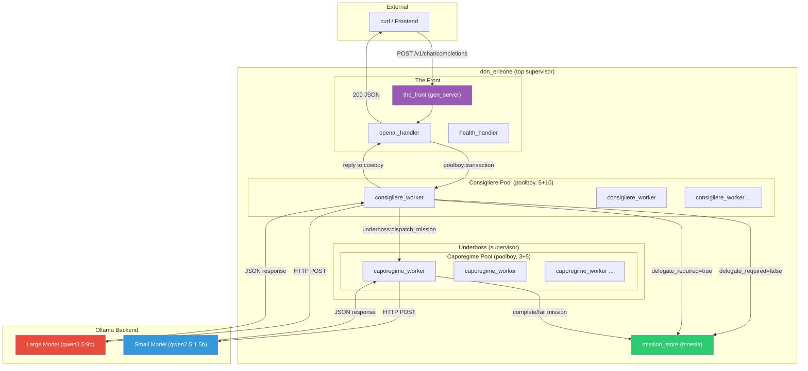
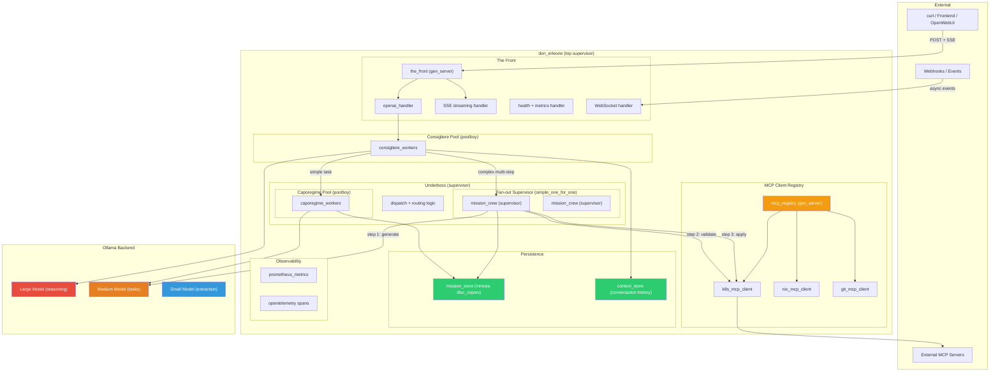

# Don Erleone — Architecture Diagrams

## Current Architecture (as implemented)

### Flow Summary

1. **Request arrives** at `/v1/chat/completions` → `openai_handler`
2. **Consigliere pool** grabs a worker → calls large Ollama model
3. Large model returns JSON with `delegate_required: true/false`
4. **If false**: Direct response to user, mission logged to mnesia
5. **If true**: Response sent to user immediately, then `underboss:dispatch_mission/1` fires async
6. **Caporegime pool** grabs a worker → calls small Ollama model with intent-specific prompt
7. Result written back to mnesia (`complete_mission` or `fail_mission`)

---

## Future Architecture (where this should go)

### Evolution Roadmap

| Phase | What | Why |
|-------|------|-----|
| **Now** | Two pools (consigliere + caporegime), fire-and-forget delegation | Simple, working, debuggable |
| **Next** | MCP client registry — gen_server that holds connections to k8s, nix, git MCP servers | Caporegime workers can call real tools, not just Ollama |
| **Next** | `disc_copies` for mnesia + conversation context store | Durability across restarts, multi-turn memory |
| **Next** | SSE streaming from Ollama through to the frontend | Real-time UX instead of blocking 30s calls |
| **Later** | Fan-out supervisor for complex multi-step missions (bring back lieutenant pattern) | k8s_deploy = generate manifest → validate → apply → verify |
| **Later** | Prometheus metrics + OpenTelemetry tracing | Observe latency per model, pool saturation, mission success rates |
| **Later** | WebSocket handler for async mission status updates | Frontend can poll/subscribe to mission completion |

### Key Principle

> Start with flat pools, promote to supervision trees when a **specific mission type** proves it needs multi-step orchestration. The archived lieutenant/recruiter/associate code in `src_archived/` is your template for that promotion.
