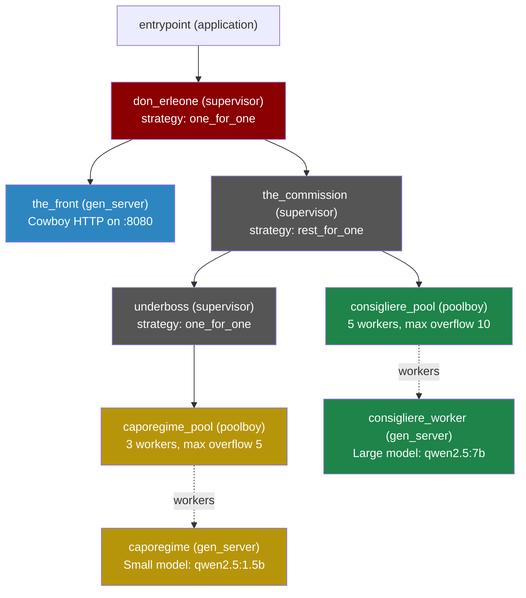
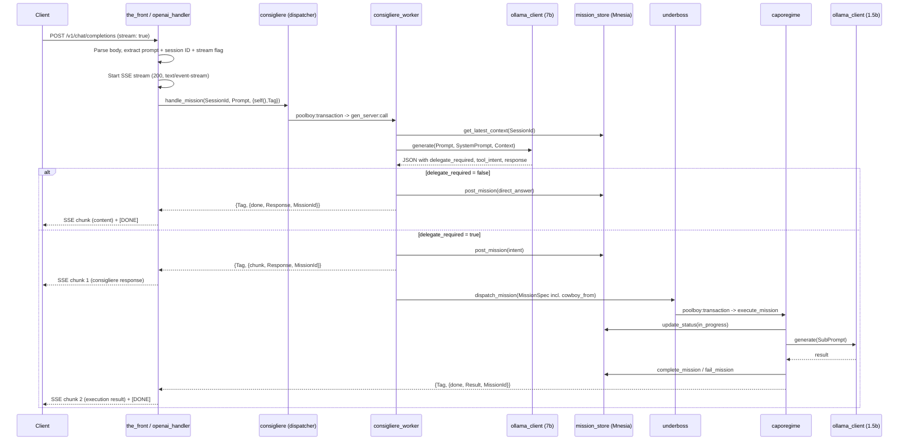
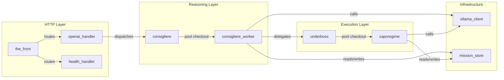

# Don Erleone — Architecture

> An Erlang/OTP agentic AI orchestrator with a Mafia-themed supervision hierarchy.
> Exposes an OpenAI-compatible HTTP API, routes user prompts through a "reasoning" LLM,
> and delegates infrastructure tasks to "execution" workers powered by a smaller LLM.

---

## 1. Supervision Tree



**Key design choice:** `the_commission` uses `rest_for_one`. The underboss starts *first*. If it crashes, the consigliere pool is also restarted — preventing workers from holding stale references to a dead caporegime pool.

---

## 2. Request Flow



---

## 3. Module Map



---

## 4. Module Details

| Module | OTP Behaviour | Role |
|---|---|---|
| `entrypoint` | `application` | Boots the app, calls `don_erleone:start_link()` |
| `don_erleone` | `supervisor` | Top-level sup. Inits Mnesia, loads configs, starts children |
| `the_front` | `gen_server` | Starts Cowboy HTTP listener on port 8080 |
| `openai_handler` | cowboy handler | Parses OpenAI-format requests, blocks on async reply from consigliere |
| `health_handler` | cowboy handler | Returns `{"status":"ok"}` on `/health` |
| `consigliere` | stateless module | Dispatches to `consigliere_pool` via `proc_lib:spawn` |
| `consigliere_worker` | `gen_server` + `poolboy_worker` | Calls the large LLM, parses JSON response, routes to direct answer or delegation |
| `the_commission` | `supervisor` | `rest_for_one` sub-supervisor owning underboss + consigliere pool |
| `underboss` | `supervisor` | Owns the caporegime pool. Exposes `dispatch_mission/1` |
| `caporegime` | `gen_server` + `poolboy_worker` | Executes delegated missions via the small LLM or MCP HTTP calls |
| `ollama_client` | stateless module | Shared HTTP client for Ollama `/api/generate` |
| `mission_store` | stateless module | Mnesia CRUD for mission records (ram_copies) |

---

## 5. Two-Model LLM Strategy

| | Consigliere (Reasoning) | Caporegime (Execution) |
|---|---|---|
| **Default model** | `qwen2.5:7b` | `qwen2.5:1.5b` |
| **Purpose** | Interpret user intent, decide routing | Execute specific tasks (k8s YAML, status checks) |
| **System prompt** | Yes — structured JSON output with `delegate_required` flag | Per-task prompts built by `build_sub_prompt/3` |
| **Timeout** | 3,600s (1 hour) | 120s |
| **Config record** | `#config{}` | `#sub_config{}` |

---

## 6. Data Records

Source: [records.hrl](file:///home/nixos/Documents/agent_project/localhost_agent/apps/don-erleone/include/records.hrl)

```erlang
%% Consigliere config
-record(config, {ollama_url, model, timeout, stream, system_prompt}).

%% Caporegime config
-record(sub_config, {ollama_url, model, timeout}).

%% Mission ledger (Mnesia table, ram_copies)
-record(mission, {
    id,              %% unique monotonic integer
    session_id,      %% peer IP string
    intent,          %% <<"k8s_deploy">>, <<"check_mcp">>, <<"direct_answer">>
    raw_prompt,      %% original user input
    status,          %% pending -> in_progress -> completed | failed
    result,          %% final result map from caporegime
    error,           %% error reason if failed
    context_tokens,  %% Ollama context array for conversational memory
    timestamp        %% erlang:system_time(second)
}).
```

**Mission lifecycle:** `pending` → `in_progress` → `completed` | `failed`

---

## 7. Async Reply Pattern (with SSE Streaming)

The `openai_handler` cannot wait on a normal `gen_server:call` through poolboy (that would hold the pool worker hostage for the entire HTTP request). Instead:

1. Handler creates `Tag = make_ref()` and passes `{self(), Tag}` as `CowboyFrom`
2. Handler starts an SSE stream with `cowboy_req:stream_reply(200, SSE headers, Req)` (when `stream: true`)
3. `consigliere:handle_mission/3` spawns a process that checks out a pool worker
4. The worker does its work, then sends `CowboyPid ! {CowboyTag, Result}` directly
   - Direct answers: `{Tag, {direct, Response, Meta}}`
   - Delegated missions: `{Tag, {delegated, Response, Meta}}`
5. The pool worker returns `{reply, ok, State}` to release itself back to poolboy
6. For delegated missions, the `CowboyFrom` is included in the `MissionSpec` and threaded through to the caporegime
7. After execution, the caporegime sends `{Tag, {execution_complete, Result}}` to the handler
8. The handler streams each message as an SSE chunk in OpenAI `chat.completion.chunk` format

**Streaming mode** (`stream: true`): The consigliere's response arrives as SSE chunk 1, then the caporegime's execution result as chunk 2, followed by `[DONE]`. This gives Open WebUI users real-time feedback.

**Non-streaming mode** (`stream: false`): The handler waits for both messages and returns a single combined JSON response. Falls back to the consigliere response only if the caporegime times out.

This decouples the HTTP request lifecycle from the pool worker lifecycle while ensuring execution results reach the client.

---

## 8. Supported Intents

The caporegime dispatches on the `tool_intent` string from the consigliere's LLM output:

| Intent | Behaviour |
|---|---|
| `k8s_deploy` | Builds a k8s-specific sub-prompt, calls small LLM for YAML manifest generation |
| `check_mcp` | If `mcp_args` contains an `endpoint` URL, makes a direct HTTP POST to that MCP endpoint. Otherwise falls back to sub-model reasoning |
| *(any other)* | Generic sub-agent prompt with intent + args, calls small LLM |

---

## 9. External Dependencies

| Dependency | Purpose |
|---|---|
| **Cowboy** | HTTP server |
| **Poolboy** | Worker pool management |
| **JSX** | JSON encode/decode |
| **Mnesia** | In-memory mission store |
| **Ollama** | Local LLM inference (external service) |
